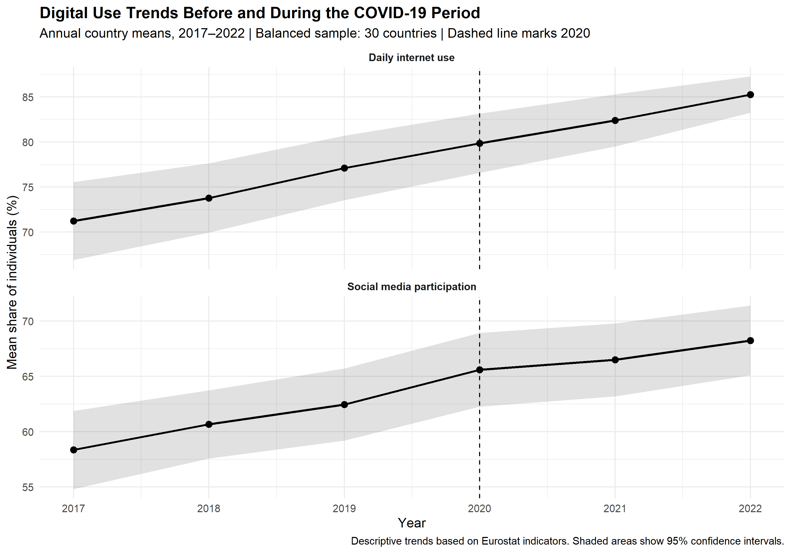
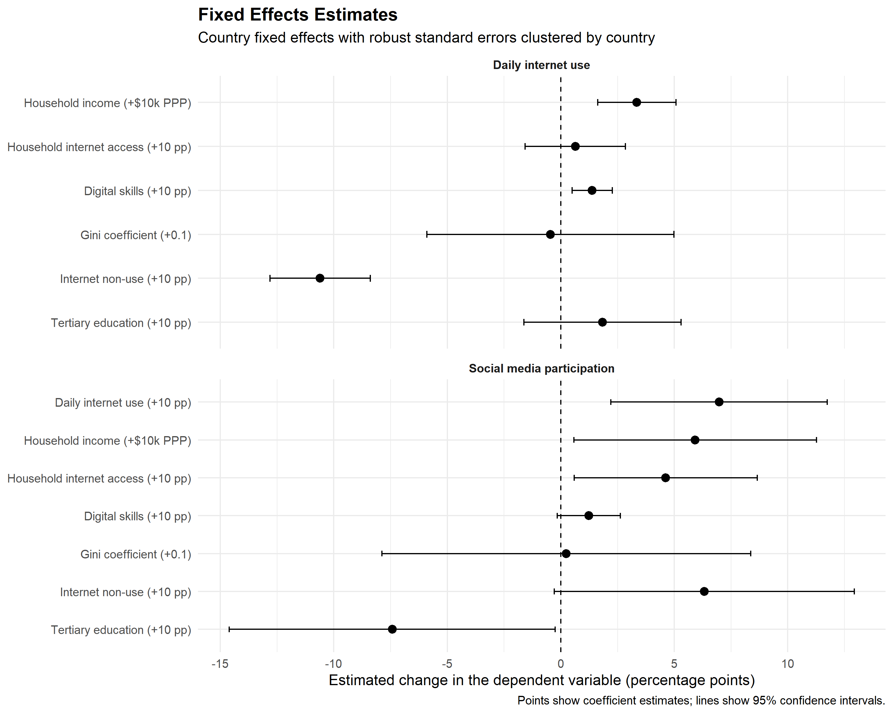
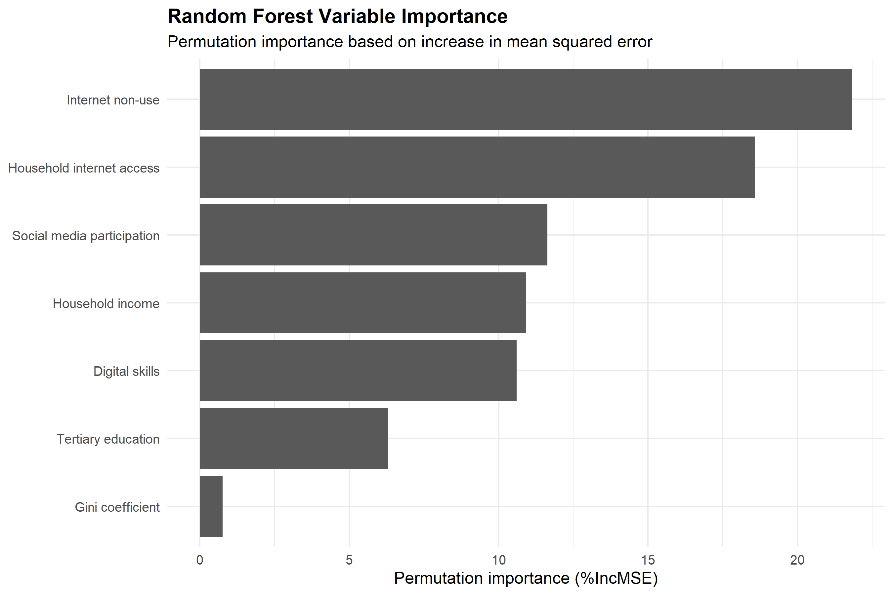
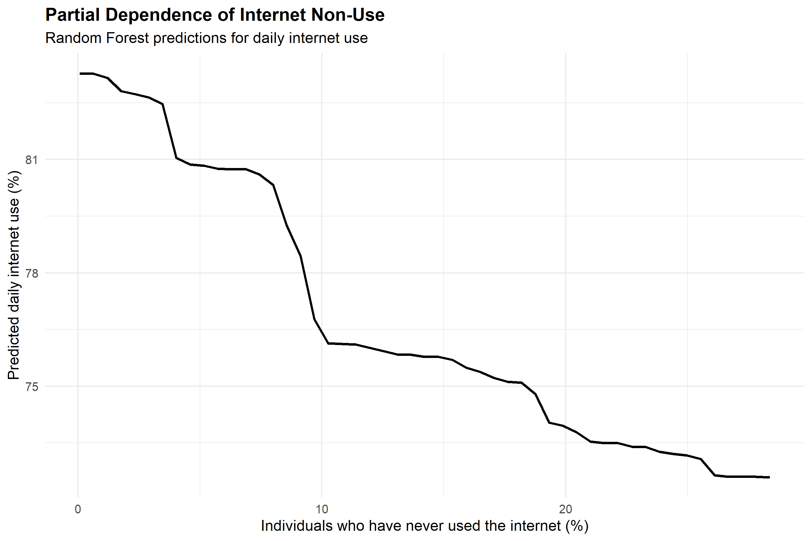
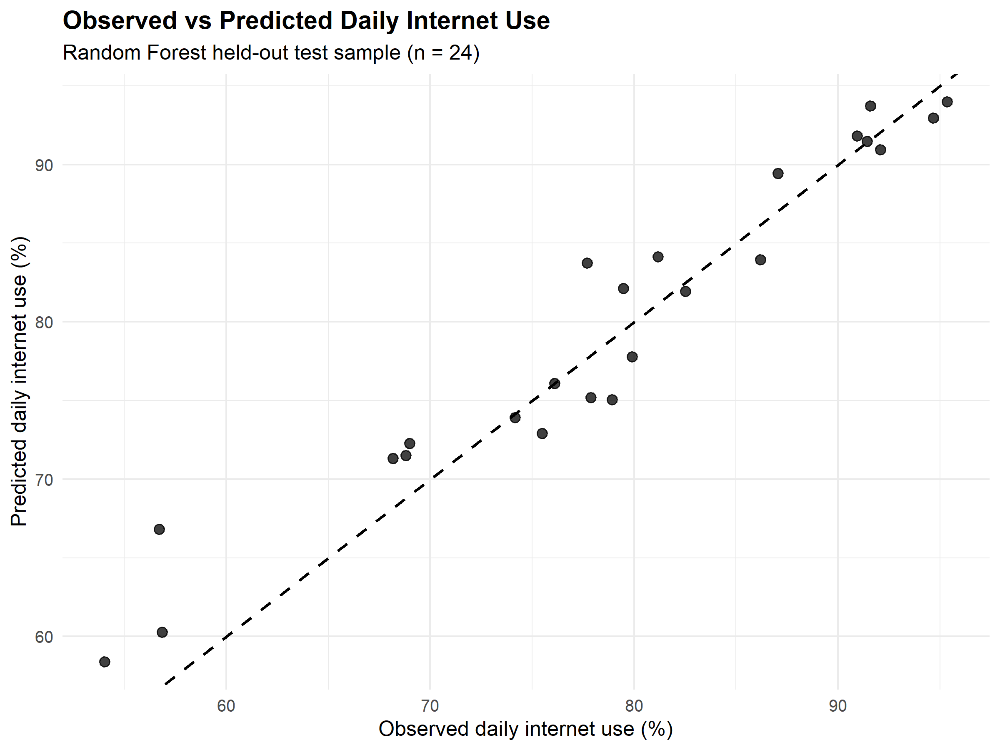

# Digital Inequality: Panel Data and Random Forest Analysis

This repository contains the reconstruction and validation of the empirical analysis developed for my Master's dissertation on digital inequality, internet use, and social media participation across European countries.

The project combines panel-data econometrics using Fixed Effects (FE) models with Random Forest (RF) predictive modeling and descriptive analysis of digital-use trends before and during the COVID-19 period.

## Key Findings

- Daily internet use is positively associated with household income and digital skills and negatively associated with the share of individuals who have never used the internet.
- The Fixed Effects model for daily internet use achieves a within R² of approximately **0.947**.
- The Fixed Effects model for social media participation achieves a within R² of approximately **0.769**.
- Random Forest achieves a predictive R² of **0.917** on the held-out test sample.
- Internet non-use and household internet access are the most important predictors in the Random Forest model.
- Digital-use indicators were already increasing before 2020, while the COVID-19 period appears to have continued or intensified the existing upward trend rather than producing a clear abrupt break.

## Research Objective

The analysis investigates how socioeconomic and digital factors are associated with:

- daily internet use;
- social media participation.

The explanatory variables include household income, income inequality, tertiary education, digital skills, household internet access, and the share of individuals who have never used the internet.

A further objective is to examine how daily internet use and social media participation evolved before and during the COVID-19 period.

## Data Sources

The dataset was reconstructed from official sources:

- **Eurostat**
  - Daily internet use
  - Social media participation
  - Household internet access
  - Individuals who have never used the internet
  - Digital skills
  - Tertiary education

- **OECD Income Distribution Database (IDD)**
  - Mean equivalised household disposable income (PPP-adjusted)
  - Gini coefficient

The original research period was **2017–2022**.

Due to the availability of the digital-skills indicator, the final complete analytical sample used for the multivariate analysis contains observations for **2017, 2019, and 2021**.

The digital-skills variable combines the older Eurostat series for 2017 and 2019 with the revised methodology available for 2021. This methodological discontinuity should therefore be considered when interpreting the results.

## Final Analytical Samples

The complete reconstructed dataset used for the multivariate analysis contains:

- **82 country-year observations**
- **30 countries**
- observations for **2017, 2019, and 2021**

For the Fixed Effects models, countries with only one observation were excluded because they provide no within-country variation.

The final Fixed Effects sample contains:

- **80 observations**
- **28 countries**
- an **unbalanced panel**

A separate descriptive dataset is used for the 2017–2022 COVID-19 trend analysis.

## Digital Trends and the COVID-19 Period

A central motivation of the original dissertation was to compare digital behavior before and during the COVID-19 period.

For the descriptive analysis:

- **2017–2019** represents the pre-pandemic period;
- **2020–2022** represents the pandemic period.

To prevent changes in country composition from driving the observed trends, the figure below uses a balanced descriptive sample of **30 countries** with observations available for both daily internet use and social media participation across all six years.

The descriptive results indicate that both indicators were already increasing before 2020. The COVID-19 period therefore appears to have continued or intensified an existing upward trend rather than producing a clear abrupt structural break.



## Methods

### Fixed Effects Models

Country Fixed Effects models are used to estimate relationships based on changes occurring within countries over time.

Robust standard errors are clustered at the country level.

Two dependent variables are analyzed:

1. Social media participation
2. Daily internet use

The Hausman test is also used to compare Fixed Effects and Random Effects specifications.

The Fixed Effects approach focuses on **within-country variation over time**, rather than simple differences between countries.

### Random Forest

Random Forest is used as a complementary predictive and exploratory method for daily internet use.

The model uses:

- **500 trees**
- a **70/30 train-test split**
- **seed = 123** for reproducibility

Random Forest is interpreted as a predictive and exploratory model rather than a causal model.

## Main Fixed Effects Results

For **daily internet use**, the reconstructed model shows statistically significant associations with:

- household income: positive;
- digital skills: positive;
- never having used the internet: negative.

The model achieves a within R² of approximately **0.947**.

For **social media participation**, significant or marginally significant relationships are found for several digital and socioeconomic variables.

The model achieves a within R² of approximately **0.769**.

Detailed coefficient estimates and Hausman-test results are available in the `results/` folder.

### Fixed Effects Coefficient Visualization

The figure below summarizes the Fixed Effects coefficient estimates and their 95% confidence intervals.

For presentation purposes, predictors are expressed in more interpretable units:

- percentage-based variables: **+10 percentage points**
- household income: **+$10,000 PPP**
- Gini coefficient: **+0.1**

The dependent variables remain expressed in percentage points.



## Random Forest Performance

Performance on the held-out test sample:

| Metric | Value |
|---|---:|
| RMSE | 3.35 |
| MAE | 2.62 |
| Predictive R² | 0.917 |
| Squared correlation (r²) | 0.934 |

The Random Forest model shows strong predictive performance on the held-out test sample (**n = 24**).

## Variable Importance

The most important predictors according to permutation importance (%IncMSE) are:

1. Internet non-use
2. Household internet access
3. Social media participation
4. Household income
5. Digital skills
6. Tertiary education
7. Gini coefficient



## Partial Dependence

The partial dependence analysis indicates a negative and nonlinear predictive relationship between the proportion of individuals who have never used the internet and predicted daily internet use.

The plot represents the average Random Forest prediction across the observed distribution of the remaining predictors and should not be interpreted as a causal effect.



## Observed vs Predicted

The observed-versus-predicted plot compares actual daily internet-use values with Random Forest predictions in the held-out test sample.

Predictions generally follow the observed values closely, although the relatively small test sample should be considered when evaluating predictive performance.



## Repository Structure

```text
digital-inequality-dissertation/
├── data/
│   ├── panel_complete_final.csv
│   ├── panel_fe_final.csv
│   └── panel_reconstruit_final.csv
├── figures/
│   ├── importanta_random_forest_final.png
│   ├── observat_vs_prezis_rf_final.png
│   └── pdp_nefolosire_internet_final.png
├── portfolio_figures/
│   ├── fixed_effects_coefficients.png
│   ├── pandemic_digital_trends_2017_2022.png
│   ├── partial_dependence_internet_nonuse.png
│   ├── random_forest_observed_vs_predicted.png
│   └── random_forest_variable_importance.png
├── results/
│   ├── importanta_random_forest_final.csv
│   ├── metrici_random_forest_final.csv
│   ├── pdp_nefolosire_internet_final.csv
│   ├── predictii_random_forest_final.csv
│   ├── tabel_fe_final_disertatie.csv
│   ├── tabel_hausman_final.csv
│   └── tabel_random_forest_final.csv
├── scripts/
│   ├── 01_data_reconstruction_FE.R
│   ├── 02_random_forest.R
│   └── 03_portfolio_figures.R
├── .gitignore
├── LICENSE
└── README.md
```

The `figures/` folder contains the original figures generated during the reconstruction process, while `portfolio_figures/` contains English-language visualizations prepared for presentation and portfolio use.

## Reproducibility

The analysis workflow can be rerun from the repository root using the scripts available in the `scripts/` folder.

The workflow is organized as follows:

### 1. Data Reconstruction and Fixed Effects

Run:

` scripts/01_data_reconstruction_FE.R `

This script:

- reconstructs indicators from Eurostat and OECD;
- builds the analytical datasets;
- prepares the Fixed Effects sample;
- estimates the Fixed Effects models;
- generates the final FE and Hausman-test results.

### 2. Random Forest

Run:

` scripts/02_random_forest.R `

This script:

- loads the final complete analytical dataset;
- creates the train/test split;
- estimates the Random Forest model;
- calculates predictive performance metrics;
- generates variable-importance, partial-dependence, and observed-vs-predicted outputs.

### 3. Portfolio Visualizations

Run:

` scripts/03_portfolio_figures.R `

This script:

- loads the final analytical and descriptive datasets;
- recreates the selected Random Forest visualizations in English;
- generates the Fixed Effects coefficient plot;
- generates the 2017–2022 COVID-19 descriptive trend figure;
- verifies that all five portfolio figures were generated successfully.

All file paths used in the scripts are relative to the repository root.

The final analytical datasets used for the reported results are included in the repository to preserve the analyzed data snapshot.

## Tools and Packages

The analysis was conducted in **R** using packages including:

- `eurostat`
- `dplyr`
- `plm`
- `lmtest`
- `sandwich`
- `randomForest`
- `caret`
- `pdp`
- `ggplot2`

## Use of AI Tools

Generative AI tools were used as supporting tools during the reconstruction, validation, debugging, and documentation of this project.

Their use included:

- assistance with code review and debugging;
- clarification of statistical and programming concepts;
- support in restructuring and documenting the R workflow;
- checking the internal consistency of reconstructed outputs;
- support in creating portfolio-oriented visualizations;
- language editing and improvement of project documentation.

AI tools were not used as a substitute for the underlying statistical analysis or for the official data sources.

The datasets were obtained from Eurostat and OECD, while the final methodological choices, model specifications, interpretations, and reported results were reviewed and validated by the author.

## Limitations

Several limitations should be considered when interpreting the results:

- the multivariate analytical sample contains observations for 2017, 2019, and 2021 because of digital-skills data availability;
- the Fixed Effects sample is an unbalanced panel;
- the digital-skills indicator underwent a methodological revision between the older and newer Eurostat series;
- the relatively small analytical sample limits the generalizability of the predictive results;
- the Random Forest test sample contains only 24 observations;
- Random Forest results are predictive and exploratory rather than causal;
- Fixed Effects coefficients represent within-country relationships over time and should not be interpreted as simple cross-country differences;
- the COVID-19 trend analysis is descriptive and should not be interpreted as causal evidence of a pandemic effect.

## License

The code in this repository is released under the MIT License.

The underlying Eurostat and OECD data remain subject to the terms and conditions of their respective data providers.


