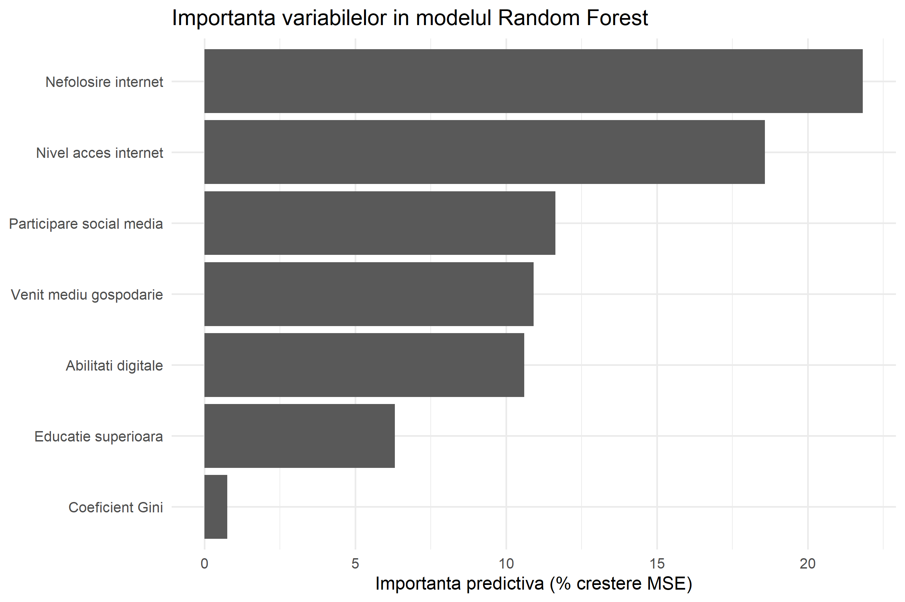
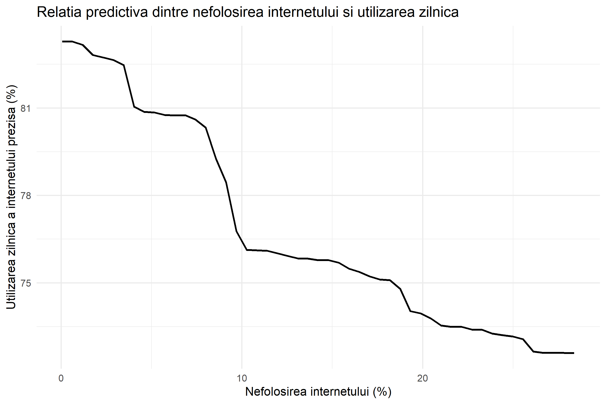
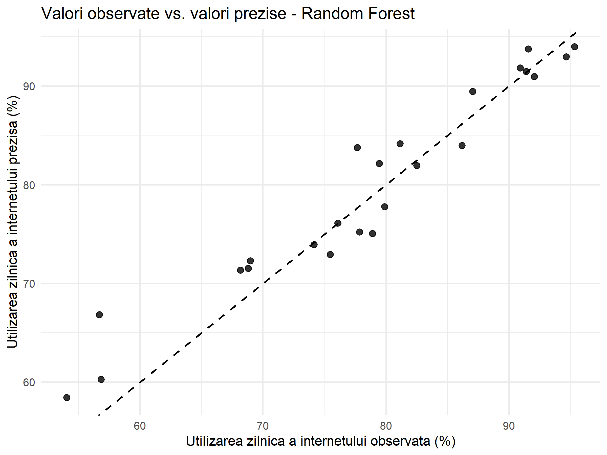

# Digital Inequality: Panel Data and Random Forest Analysis

This repository contains the reconstruction and validation of the empirical analysis developed for my Master's dissertation on digital inequality, internet use, and social media participation across European countries.

The project combines panel-data econometrics using Fixed Effects (FE) models with Random Forest (RF) predictive modeling.

## Research Objective

The analysis investigates how socioeconomic and digital factors are associated with:

- daily internet use;
- social media participation.

The explanatory variables include household income, income inequality, tertiary education, digital skills, household internet access, and the share of individuals who have never used the internet.

## Data Sources

The dataset was reconstructed from official sources:

- **Eurostat**
  - Daily internet use
  - Social media participation
  - Household internet access
  - Individuals who have never used the internet
  - Digital skills
  - Tertiary education

- **OECD Income Distribution Database (IDD)**
  - Mean equivalised household disposable income (PPP-adjusted)
  - Gini coefficient

The original research period was 2017–2022. Due to the availability of the digital-skills indicator, the final complete analytical sample contains observations for 2017, 2019, and 2021.

The digital-skills variable combines the older Eurostat series for 2017 and 2019 with the revised methodology available for 2021. This methodological discontinuity should therefore be considered when interpreting the results.

## Final Analytical Samples

The complete reconstructed dataset contains:

- 82 country-year observations;
- 30 countries;
- years 2017, 2019, and 2021.

For the Fixed Effects models, countries with only one observation were excluded because they provide no within-country variation.

The final FE sample contains:

- 80 observations;
- 28 countries;
- an unbalanced panel.

## Methods

### Fixed Effects Models

Country Fixed Effects models are used to estimate relationships based on changes occurring within countries over time.

Robust standard errors are clustered at the country level.

Two dependent variables are analyzed:

1. Social media participation
2. Daily internet use

The Hausman test is also used to compare Fixed Effects and Random Effects specifications.

### Random Forest

Random Forest is used as a complementary predictive method for daily internet use.

The model uses:

- 500 trees;
- a 70/30 train-test split;
- seed = 123 for reproducibility.

Random Forest is interpreted as a predictive and exploratory model rather than a causal model.

## Main Fixed Effects Results

For **daily internet use**, the reconstructed model shows statistically significant associations with:

- household income: positive;
- digital skills: positive;
- never having used the internet: negative.

The model achieves a within R² of approximately **0.947**.

For **social media participation**, significant or marginally significant relationships are found for several digital and socioeconomic variables.

The model achieves a within R² of approximately **0.769**.

Detailed coefficient estimates and Hausman-test results are available in the `results/` folder.

## Random Forest Performance

Performance on the test sample:

| Metric | Value |
|---|---:|
| RMSE | 3.35 |
| MAE | 2.62 |
| Predictive R² | 0.917 |
| Squared correlation (r²) | 0.934 |

The Random Forest model shows strong predictive performance on the held-out test sample (n = 24).

## Variable Importance

The most important predictors according to permutation importance (%IncMSE) are:

1. Never used the internet
2. Household internet access
3. Social media participation
4. Household income
5. Digital skills
6. Tertiary education
7. Gini coefficient



## Partial Dependence

The partial dependence analysis indicates a negative and nonlinear predictive relationship between the proportion of individuals who have never used the internet and predicted daily internet use.



## Observed vs Predicted

The observed-versus-predicted plot shows that Random Forest predictions are generally close to the observed values in the test sample.



## Repository Structure

```text
digital-inequality-dissertation/
├── data/
│   ├── panel_complete_final.csv
│   └── panel_fe_final.csv
├── figures/
│   ├── importanta_random_forest_final.png
│   ├── observat_vs_prezis_rf_final.png
│   └── pdp_nefolosire_internet_final.png
├── results/
│   ├── importanta_random_forest_final.csv
│   ├── metrici_random_forest_final.csv
│   ├── pdp_nefolosire_internet_final.csv
│   ├── predictii_random_forest_final.csv
│   ├── tabel_fe_final_disertatie.csv
│   ├── tabel_hausman_final.csv
│   └── tabel_random_forest_final.csv
├── scripts/
│   ├── 01_data_reconstruction_FE.R
│   └── 02_random_forest.R
├── .gitignore
├── LICENSE
└── README.md
```

## Reproducibility

The analysis workflow can be rerun from the repository root using the scripts available in the `scripts/` folder.

The workflow is organized as follows:

1. Run `scripts/01_data_reconstruction_FE.R`
   - reconstructs the indicators from Eurostat and OECD;
   - builds the analytical datasets;
   - prepares the Fixed Effects sample;
   - estimates the Fixed Effects models;
   - generates the final FE and Hausman test results.

2. Run `scripts/02_random_forest.R`
   - loads `data/panel_complete_final.csv`;
   - creates the train/test split;
   - estimates the Random Forest model;
   - calculates predictive performance metrics;
   - generates the variable importance, partial dependence, and observed-vs-predicted outputs.

All file paths used in the scripts are relative to the repository root.

The final analytical datasets used for the reported results are included in the repository to preserve the analyzed data snapshot.

## Use of AI Tools

Generative AI tools were used as supporting tools during the reconstruction, validation, and documentation of this project.

Their use included:

- assistance with code review and debugging;
- clarification of statistical and programming concepts;
- support in restructuring and documenting the R workflow;
- checking the internal consistency of reconstructed outputs;
- language editing and improvement of project documentation.

AI tools were not used as a substitute for the underlying statistical analysis or for the official data sources.

The datasets were obtained from Eurostat and OECD, while the final methodological choices, model specifications, interpretations, and reported results were reviewed and validated by the author.

## Tools and Packages

The analysis was conducted in R using packages including:

- `eurostat`
- `dplyr`
- `plm`
- `lmtest`
- `sandwich`
- `randomForest`
- `caret`
- `pdp`
- `ggplot2`

## Limitations

Several limitations should be considered when interpreting the results:

- the final complete analytical sample contains observations for 2017, 2019, and 2021;
- the Fixed Effects sample is an unbalanced panel;
- the digital-skills indicator underwent a methodological revision between the older and newer Eurostat series;
- the relatively small analytical sample limits the generalizability of the predictive results;
- Random Forest results are predictive and exploratory rather than causal;
- Fixed Effects coefficients represent within-country relationships over time and should not be interpreted as simple cross-country differences.

## License

The code in this repository is released under the MIT License.

The underlying Eurostat and OECD data remain subject to the terms and conditions of their respective data providers.


